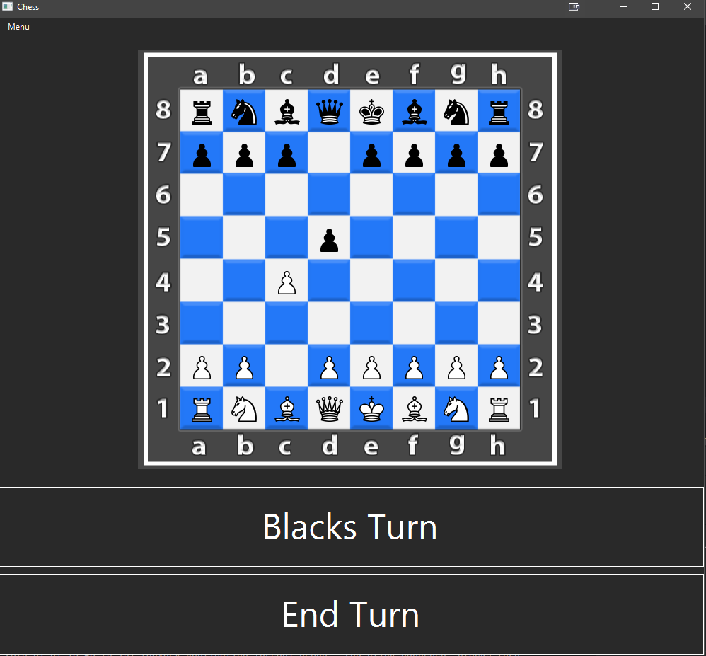
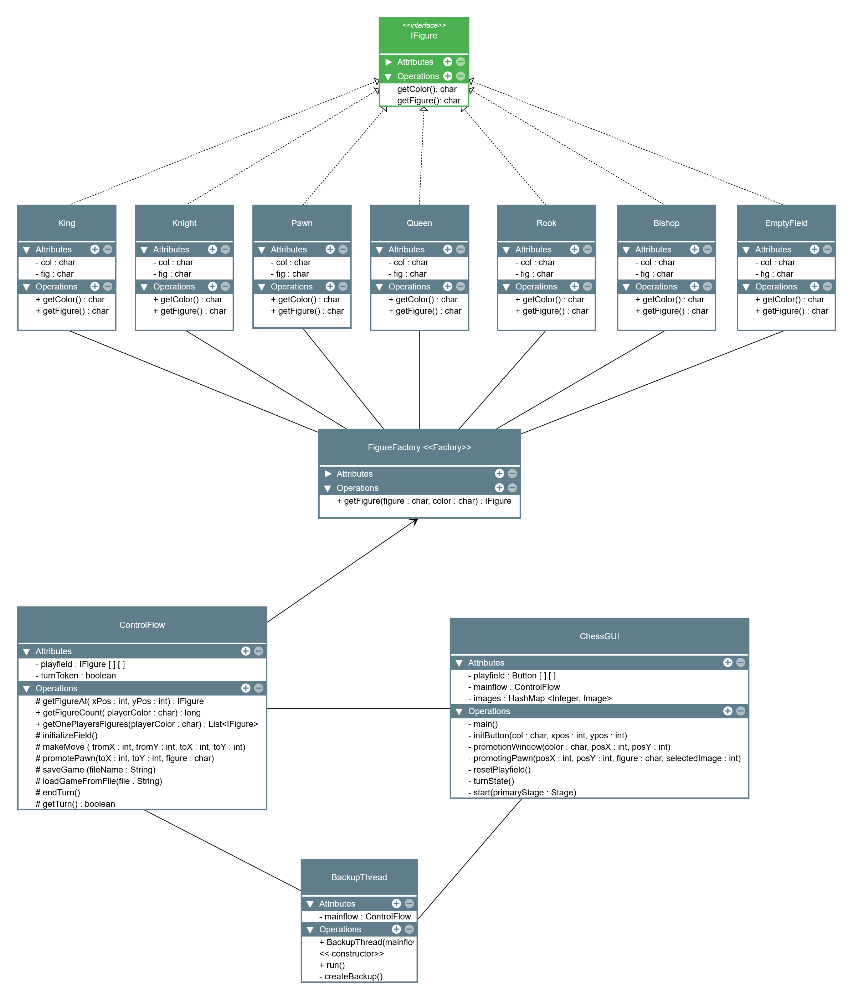

# Description

A chess game I implemented back in 2019 as project for my Software Engineering class. 
Players can play locally, taking turns. Additionally they can reset the field, save the game manually and load both an automatic backup or the manual save.
The goal of the project was to learn design patterns, Clean Code, Unit Testing, GUI development, Logging, Exceptions, UML, Multithreading, Streams and Profiling. Multithreading has been implemented using a thread that backs up the game automatically after 45 seconds, every 5 seconds.  

Following UML Class Diagram (created with https://www.yworks.com/yed-live/) describes the architecture:

We have a Figure Interface, `IFigure`, which is implemented by the different chess figure types. The Figure Factory (following the Factory design pattern) `FigureFactory` returns each individual chess piece to the `ControlFlow` class. `ControlFlow` controls the game logic. `ChessGUI` is responsible for the graphical user interface and controls the actions executed in `ControlFlow`. The class `BackupThread` automatically saves the state of the field after 45 seconds have passed, every 5 seconds.

# Requirements
**Java**: JDK 23 or higher
**Maven**: 3.9.8 or higher

## Key Dependencies
The project uses the following libraries:

- **JavaFX** (17.0.6)
  - `javafx-controls`
  - `javafx-fxml`
  - `javafx-graphics`
  - `javafx-media`
  - `javafx-base`
- **JUnit** (4.13.1): For unit testing.
- **Log4j** (2.17.1): For logging and application diagnostics.

All dependencies are managed through Maven. For the full list, see the `pom.xml` file.

# How to Run
Open the project in the IDE of your choice, I used `IntelliJ IDEA`. Sync the Maven file and Run `de.hdmstuttgart.mi.se2.tb130.chess.ChessGUI`.
Alternatively, you can also build it with Maven and run the jar.